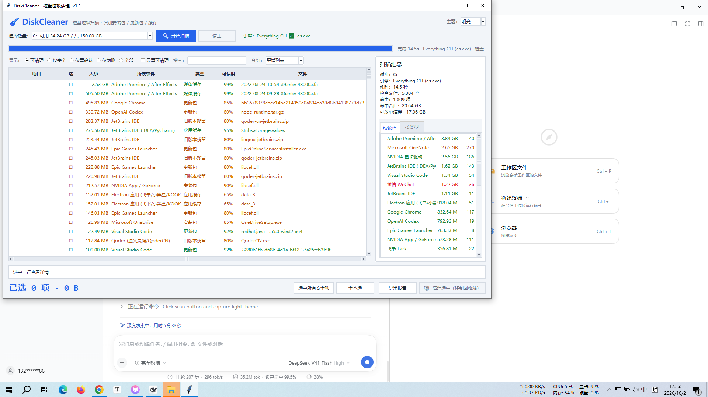

# DiskCleaner · 磁盘垃圾清理小工具

选一个盘 → 一键扫描 → 告诉你**每个文件属于哪个软件、是什么包**（安装包 / 更新包 / 旧版本 / 各种缓存）→ 勾选后移到回收站。



---

## 快速开始

直接双击 **`dist\DiskCleaner.exe`**（单文件，10.6 MB，免安装，拷到任何 Windows 电脑都能跑）。

界面操作：

1. **选择磁盘** — 下拉框里会显示各盘符和剩余空间，默认选中空间最紧张的盘
2. **点「🔍 开始扫描」** — 右侧实时显示进度，C 盘通常 15 秒左右
3. **勾选要清理的项** — 点最左边的「选」列切换勾选；也可以点「选中所有安全项」一键全勾
4. **点「🧺 清理选中」** — 移到回收站（可还原），确认回收站没问题后再清空以真正释放空间

默认是**明亮主题**，右上角可随时切到深色。

---

## 功能说明

### 扫描引擎

| 引擎 | 条件 | 速度 | 说明 |
|---|---|---|---|
| **Everything CLI** | 装了 Everything 且能找到 `es.exe` | C 盘约 **14 秒** | 走 Everything 的文件索引，推荐 |
| **Python 遍历** | 没有 `es.exe` 时自动回退 | 慢很多 | 不依赖任何外部程序，纯 `os.walk` |

界面右上角会显示当前用的是哪个引擎。找不到 `es.exe` 时可以用环境变量 `ES_EXE` 手动指定路径。

### 结果分级

| 颜色 | 等级 | 含义 |
|---|---|---|
| 🟢 绿 | **安全** | 纯缓存，删了软件自己会重建（着色器缓存、浏览器缓存、缩略图缓存…） |
| 🟡 橙 | **需确认** | 安装包 / 更新包 / 旧版本，删了没影响但重装时要重新下载 |
| 🔴 红 | **勿删** | 你的数据或系统必需（OneNote 备份、还原点…），**勾选框是「—」，无法勾选** |

筛选栏默认是「可清理」，已自动隐藏「勿删」项；想看全部就点「全部」。

### 输出信息

每一行都标出：

- **大小** — 文件体积
- **所属软件** — 例如 `Adobe Premiere / After Effects`、`NVIDIA 显卡驱动`、`Qoder (通义灵码/QoderCN)`
- **类型** — 安装包 / 更新包 / 旧版本残留 / 着色器缓存 / 媒体缓存 / 应用缓存 / 浏览器缓存 / 日志 / 临时文件 …
- **可信度** — 规则匹配的可靠程度（0–100%）
- **文件** — 文件名

选中一行，底部会显示**完整路径**和**清理建议**。双击一行可在资源管理器中定位。

### 右侧汇总

- 「按软件」标签页：每个软件占了多少、多少项（双击某一项 = 只看这个软件）
- 「按类型」标签页：安装包 / 更新包 / 缓存各占多少

### 导出报告

「导出报告」支持三种格式：

- **CSV**（带 BOM，Excel 直接打开不乱码）
- **Markdown** — 适合贴到笔记里存档
- **JSON** — 适合脚本再处理

### 其它

- **主题切换**：右上角下拉框可在「明亮 / 深色」之间切换，默认明亮；切换时保留当前扫描结果，不用重扫
- **右键菜单**：定位文件 / 清空回收站 / 永久删除（双重确认）
- **搜索框**：按路径或软件名实时过滤
- **分组**：平铺列表 / 按软件分组 / 按类型分组

---

## 安全性设计

1. **默认走回收站**，不是直接删除 — 删错了可以还原
2. **危险项不可勾选** — OneNote 备份、系统还原点这类标 🔴 的项，勾选框显示「—」并禁用，`选中所有安全项` 也会跳过它们
3. **系统关键目录不作为扫描目标** — `WinSxS`、`DriverStore`、`Windows\Installer`、`WindowsApps` 这些明确不该手删的，工具不会把它们列为可清理项（规则库里保留说明，只是不扫描）
4. **永久删除需要双重确认**
5. **不动注册表、不动程序本体** — 只处理规则库命中的文件

---

## 规则库（signatures.json）

64 条规则，全部来自一次真实的 C 盘全盘排查。字段：

```jsonc
{
  "id": "nvidia-downloader",          // 唯一标识
  "software": "NVIDIA App / GeForce", // 界面上显示的「所属软件」
  "category": "installer",            // 类型（对应 categories 里的中文标签）
  "risk": "medium",                   // safe | medium | danger
  "confidence": 90,                   // 可信度 0-100
  "path": ["%PROGRAMDATA%\\NVIDIA Corporation\\Downloader\\*"],
  "min_size": 1048576,                // 小于这个体积就忽略（避免噪音）
  "advice": "删了下次更新会重新下载 600+ MB。",
  "reclaimable": true                 // false = 不建议清理
}
```

**路径写法**：支持 `%LOCALAPPDATA%` `%APPDATA%` `%USERPROFILE%` `%PROGRAMDATA%` `%PROGRAMFILES%` `%PROGRAMFILES(X86)%` `%SYSTEMDRIVE%` 占位符。

**通配符**：`\*` 表示「该目录及其下任意层级」，`*` 不跨目录分隔符。

想加自己的规则，直接编辑 `signatures.json` 再重启程序即可（源码运行时生效；exe 需要重新打包）。

已覆盖的软件（部分）：NVIDIA、Adobe、VMware、JetBrains（IDEA/PyCharm）、VS Code、Cursor、Chrome、Edge、OneNote、Office、OneDrive、微信、QQ/QQEX/QQLive、飞书、Epic、EA 反作弊、Steam、Discord、Slack、Postman、Docker、Qoder、GitKraken、Codex、Grok、npm/pnpm/Yarn/pip/uv/Gradle/Maven/NuGet、Windows 系统缓存与日志…

---

## 从源码运行

```powershell
# 只需要 Python 3.9+（tkinter 是标准库），无需 pip 安装任何依赖
python disk_cleaner.pyw

# 命令行方式自测扫描（不启动界面）
python scanner.py C: --engine es --top 25
python scanner.py C: --engine walk      # 强制用 Python 遍历
```

## 重新打包成 exe

```powershell
pip install pyinstaller
build_exe.bat              # 或 build_exe.bat D:\app\python\python.exe
```

产物在 `dist\DiskCleaner.exe`。

---

## 文件结构

```
DiskCleaner\
├─ dist\DiskCleaner.exe     打包好的单文件程序（直接用这个）
├─ disk_cleaner.pyw         界面主程序（tkinter）
├─ scanner.py               扫描引擎 + 规则匹配（可独立命令行使用）
├─ signatures.json          规则库，64 条
├─ build_exe.bat            一键打包脚本
├─ screenshot.png           界面截图
└─ build\                   打包中间产物（可删）
```

---

## 常见问题

**Q：扫描很慢？**
先确认右上角显示的是 `Everything CLI ✅`。如果显示「Python 遍历」，说明没找到 `es.exe`，装一个 [Everything](https://www.voidtools.com/) 即可提速几十倍。

**Q：点了清理但磁盘空间没变？**
文件进了回收站，**空间还没真正释放**。右键 → 清空回收站，或手动清空。

**Q：有些文件提示「占用/权限」删不掉？**
文件正在被程序使用，或需要管理员权限。先关掉对应软件（浏览器、IDE、微信等）；系统目录里的文件需要**以管理员身份运行**本工具。

**Q：C 盘还是不够用怎么办？**
本工具不碰这几个大头，需要用系统命令处理：

```powershell
# WinSxS 组件清理（管理员，通常能回收 3-6 GB）
Dism.exe /Online /Cleanup-Image /StartComponentCleanup

# Windows 磁盘清理（勾选「以前的 Windows 安装」等）
cleanmgr

# 系统还原点占用
vssadmin list shadowstorage
```

**Q：想删掉休眠文件 hiberfil.sys（通常 3 GB 左右）？**
不能直接删。管理员执行 `powercfg /h off`（会同时关闭快速启动）。

**Q：怎么确认某个软件被识别成什么？**
用命令行：`python scanner.py C: --engine es --top 50`，会按「按软件」汇总打印。
